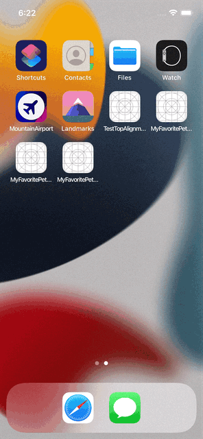

# MyFavoritePets-SwiftUI
SwiftUI app to showcase [The 🐈‍⬛ API](https://thecatapi.com/).

# Features:
* Show breeds list
* Filter breeds list
* Show breed detailed info and thumbnails carousel
* Full screen breed images carousel

## Possible future work
* Dark mode support
* Localization
* Offline data persistence
* Favorite breeds/images
* Tab bar to switch between cats ([The 🐈‍⬛ API](https://thecatapi.com/)) and dogs ([The 🐕 API](https://thedogapi.com/))

## TODO
* Migrate to Observation framework
* Add unit and UI tests
